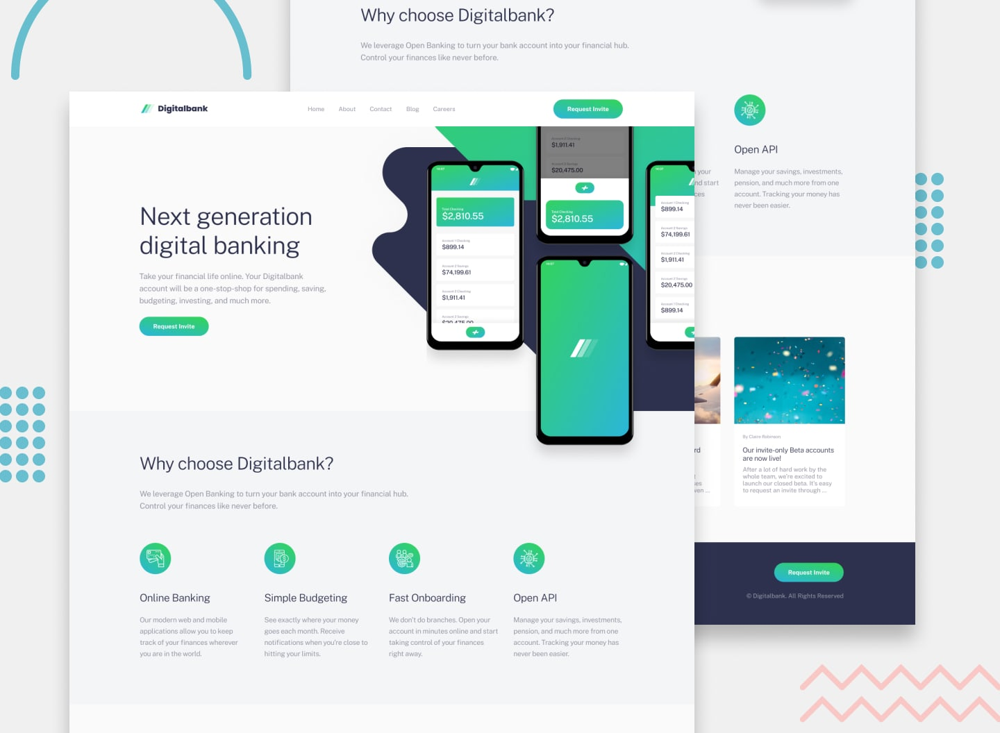

# Frontend Mentor - デジタルバンク ランディングページ（実装済コード）

これは [Frontend Mentor の Easybank landing page チャレンジ](https://www.frontendmentor.io/challenges/digital-bank-landing-page-WaUhkoDN) に対する実装コードです。支給されたデザインカンプをもとに、vw やメディアクエリを用いた可変（Fluid）レスポンシブ対応、交差監視API（Intersection Observer）によるスクロール連動演出、および Vanilla JS を用いた画面幅連動型のUIインタラクションの実装を行いました。

## 目次

- [概要](#概要)
  - [要件・機能](#要件機能)
  - [スクリーンショット](#スクリーンショット)
  - [リンク](#リンク)
- [開発プロセス](#開発プロセス)
  - [ディレクトリ構造](#ディレクトリ構造)
  - [使用技術・環境](#使用技術環境)
  - [こだわった技術的アプローチ](#こだわった技術的アプローチ)
    - [1. セマンティック・マークアップを意識したHTML構造](#1-セマンティックマークアップを意識したhtml構造)
    - [2. ビューポート幅に追従する可変レイアウト（SCSS）](#2-ビューポート幅に追従する可変レイアウトscss)
    - [3. 画面幅に応じたナビゲーション制御（Vanilla JS）](#3-画面幅に応じたナビゲーション制御vanilla-js)
    - [4. 交差監視APIによるスクロール連動演出（Vanilla JS）](#4-交差監視apiによるスクロール連動演出vanilla-js)
  - [今回の開発での気づき（今後挑戦したいこと）](#今回の開発での気づき（今後挑戦したいこと）)
- [制作者](#制作者)

## 概要

### 要件・機能

支給されたデザインカンプ（モバイル：375px / デスクトップ：1440px）をもとにスタイルを起こし、以下のインタラクションを実装しています。

- **可変（Fluid）レスポンシブレイアウト:** 主な要素のサイズ指定にビューポート幅（vw）を活用し、スマートフォンからPCまでの各デバイス幅において、デザインの比率を維持したまま滑らかに縮尺が変化するビジュアルを構築。
- **ブレイクポイント連動型ハンバーガーメニュー:** モバイル環境（1439px以下）のみで機能するナビゲーション。展開時は背景を暗転させるオーバーレイマスクが同期し、背後のコンテンツへの干渉を防ぐ設計。
- **交差監視によるフェードイン演出:** `Intersection Observer API`（交差監視API）を利用した、スクロールに連動するフェードイン演出。

### スクリーンショット



### リンク

- ライブサイト（公開ページ）: [https://yama5504.github.io/digitalbank-landing-page/](https://yama5504.github.io/digitalbank-landing-page/)

---

## 開発プロセス

### ディレクトリ構造

Vite環境における静的アセット管理およびSassのコンパイル構造に基づき、メンテナンス性を意識したディレクトリ設計を行っています。ローカルの `node_modules/` およびビルド成果物（`dist/`）は `.gitignore` を用いてGit管理対象から除外しています。

```text
.
├── .github/
│   └── workflows/           # GitHub Actions自動デプロイ設定
├── .gitignore               # Git管理除外設定
├── README.md                # 本ドキュメント
├── index.html               # メインHTML（エントリーポイント）
├── package-lock.json        # 依存ライブラリのバージョンロック
├── package.json             # プロジェクト依存関係・ビルドスクリプト定義
├── preview.jpg              # README表示用のプレビュー画像
├── vite.config.js           # Vite設定ファイル
├── design/                  # 支給されたデザインカンプ
│   ├── active-states.jpg
│   ├── desktop-design.jpg
│   ├── mobile-design.jpg
│   └── mobile-navigation.jpg
├── public/                  # 静的アセットディレクトリ
│   └── images/              # ロゴ、各種アイコン、背景用SVG/画像等
└── src/                     # ソースコード開発ディレクトリ
    ├── main.js              # 全体統合用のメインJS
    ├── css/
    │   └── style.scss       # 変数・コンポーネントを包括するSCSS
    └── js/
        └── script.js        # DOM操作・ナビゲーション制御を行うVanilla JS
```
### 使用技術・環境
- 言語・マークアップ: HTML5 / SCSS (Sass) / Vanilla JS (ES6+)
- リセットCSS: destyle.css (npm管理・SCSS側でのインポート)
- ビルドツール: Vite
- 環境自動化: GitHub ActionsによるGitHub Pagesへの自動デプロイパイプライン構築

### こだわった技術的アプローチ
#### 1. セマンティック・マークアップを意識したHTML構造

header, main, section, footer などの適切なタグを選定し、文書の論理構造に基づいたマークアップを行いました。見出しタグ（h1〜h3）の適切な階層構造を意識し、SEOやスクリーンリーダーなどの支援技術に配慮した論理的なマークアップに努めています。

#### 2. ビューポート幅に追従する可変レイアウト（SCSS）

font-size や padding、margin などのスタイリングに vw 単位を柔軟に取り入れることで、特定のブレイクポイント間で文字溢れや意図しないレイアウト崩れが起きにくい設計にしました。どのデバイス幅で閲覧してもカンプのトーン＆マナーを維持できるよう配慮しています。

#### 3. 画面幅に応じたナビゲーション制御（Vanilla JS）

モバイルナビゲーションの実装において、PC表示（1440px以上）に切り替わった際には不要となるイベントリスナーの制御を行っています。画面幅の変更（resize）を検知し、デスクトップ表示時にはモバイル用のスタイルクラスや不要なイベントリスナーの登録状態を動的にクリアするロジックを構築しました。

#### 4. 交差監視APIによるスクロール連動演出（Vanilla JS）

従来の window.addEventListener('scroll') を用いた過剰なイベント発火によるブラウザへの負荷を避けるため、IntersectionObserver を採用しました。

要素が画面内に10%交差した瞬間（threshold: 0.1）に .is-active クラスを付与してアニメーションを発火させ、同時に observer.unobserve() によって即座に監視を終了させることで、無駄なリソース消費を抑えた滑らかなスクロール演出を実現しています。

### 今回の開発での気づき（今後挑戦したいこと）
**アクセシビリティ（WAI-ARIA）の考慮:** ハンバーガーメニュー開閉に伴い、スクリーンリーダー利用者にもナビゲーションの状態が明示的に伝わるよう、aria-expanded の動的制御や、メニュー展開時のキーボード操作におけるフォーカス制御（Tabキーの移動範囲制限）の実装を追加したいと考えています。

**JavaScriptのモジュール化とリファクタリング:** 現状は script.js 内にUI制御のロジックをまとめて記述していますが、今後の機能拡張やメンテナンス性を考慮し、機能ごとにESモジュールとして分割・管理する構成へのリファクタリングに挑戦したいです。

## 制作者
GitHub - @yama5504